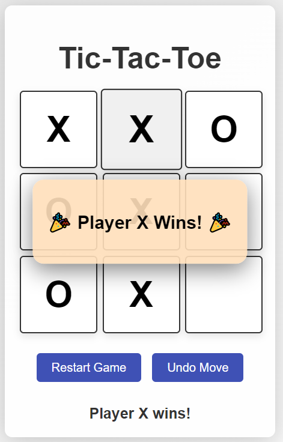

# Tic-Tac-Toe Game

## Description
A simple Tic-Tac-Toe game built using HTML, CSS, and JavaScript. This game allows two players to compete against each other, with features including move tracking, win celebration, and an undo option.

## Features
- Two-player game
- Win detection with celebratory popup
- Undo last move
- Responsive design with colorful UI

## Technologies Used
- HTML
- CSS
- JavaScript

## How to Play
1. Players take turns clicking on the empty squares to place their marker (X or O).
2. The first player to align three markers horizontally, vertically, or diagonally wins.
3. Use the "Undo Move" button to revert the last action.
4. Click "Restart Game" to play again.

## Installation
To run this project locally, clone the repository and open `index.html` in your web browser.

## Screenshot

## License
This project is licensed under the MIT License - see the [LICENSE](LICENSE) file for details.
